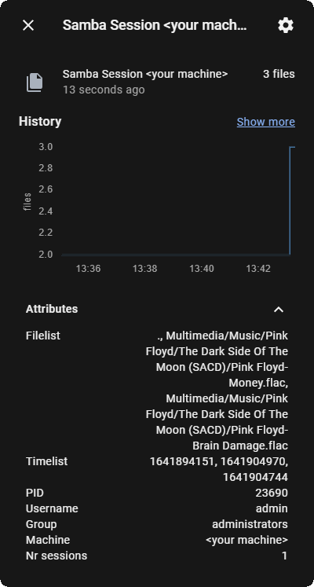

# Samba File Reservation Sensor


This script creates a MQTT sensor that lists all files currently being shared over Samba/Cifs. Additionally, it includes the attributes shown in the example below:




It is assumed that `/usr/local/samba/bin/smbstatus` exists.

## Cron job
Since the script is configured to run only once for a single update it is advised to create a cron job for regular updates.

### Example: 
run `crontab -e` and add the following to the end of the file:
```
*\1 * * * *  python3 <path to smbstatus.py>
```
This job runs every minute and automatically installed after saving the crontab file.